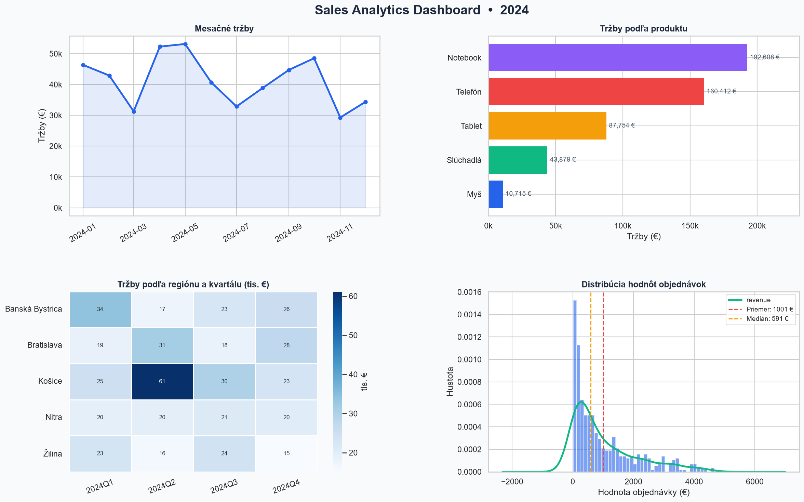

# Sales Data Analysis

Python project analyzing sales data with visualizations.



## What it does
- Generates realistic sales data (500 records)
- Cleans data and removes outliers
- Creates a 4-panel dashboard (line chart, bar chart, heatmap, histogram)
- Exports monthly summary to CSV

## Technologies
- Python 3.14
- pandas, numpy, matplotlib, seaborn

## How to run
```
pip install pandas numpy matplotlib seaborn
python analysis.py
```

## Output
- `dashboard.png` — visual charts
- `summary.csv` — monthly summary by product
